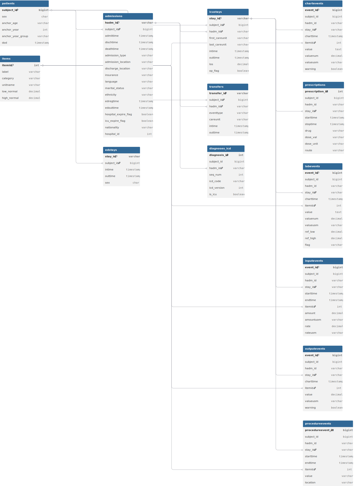

# Patient-Journey-Mapping


[참조링크]: https://heerim0223.github.io/Patient-Journey-Mapping/

### How To Use
1. 프로필 이미지를 누르면 환자 목록이 나타납니다.
2. 환자 목록을 누르면 환자별 정보가 불러와지며, 각 환자별 상태가 시각화됩니다.   
3. 좌측하단의 인체 모형에 마우스를 가져가면 정확한 정보가 보여집니다.
4. 우측 하단의 입력창과 전송버튼을 통해 환자의 특이사항 기록이 서버로 저장됩니다.<br>
(아직 미구현이지만, 환자 정보를 전송하면 영구적으로 변하기는 합니다.)

---

# ERD(csv->sql)



> ```
> KMIMIC_EMR/260~460
> ├─ ADMISSIONS.csv  
> │  ├─ SUBJECT_ID, HADM_ID, ADMITTIME, DISCHTIME, DEATHTIME  
> │  ├─ ADMISSION_TYPE, ADMISSION_LOCATION, DISCHARGE_LOCATION  
> │  ├─ INSURANCE, LANGUAGE, MARITAL_STATUS, ETHNICITY  
> │  ├─ EDREGTIME, EDOUTTIME  
> │  ├─ HOSPITAL_EXPIRE_FLAG, ICU_EXPIRE_FLAG  
> │  ├─ NATIONALITY, HOSPITAL_ID  
> │  
> ├─ CHARTEVENTS.csv  
> │  ├─ CHARTEVENT_ID, SUBJECT_ID, HADM_ID, STAY_ID  
> │  ├─ CHARTTIME, STORETIME, ITEMID  
> │  ├─ VALUE, VALUENUM, VALUEUOM, WARNING  
> │  
> ├─ DATETIMEEVENTS.csv  
> │  ├─ DATETIMEEVENT_ID, SUBJECT_ID, HADM_ID, STAY_ID  
> │  ├─ CHARTTIME, STORETIME, ITEMID  
> │  ├─ VALUE, VALUEUOM, WARNING  
> │  
> ├─ DIAGNOSES_ICD.csv  
> │  ├─ SUBJECT_ID, HADM_ID, SEQ_NUM  
> │  ├─ ICD_CODE, ICD_VERSION, ITEMID, IS_ICU  
> │  
> ├─ D_ITEMS.csv  
> │  ├─ ITEMID, LABEL, ABBREVIATION, LINKSTO  
> │  ├─ CATEGORY, UNITNAME, PARAM_TYPE  
> │  ├─ LOWNORMALVALUE, HIGHNORMALVALUE  
> │  
> ├─ D_LABITEMS.csv  
> │  ├─ ITEMID, LABEL, FLUID, CATEGORY, EDI_CODE  
> │  
> ├─ D_TESTITEMS.csv  
> │  ├─ ITEMID, LABEL, CATEGORY, EDI_CODE  
> │  
> ├─ EDSTAY.csv  
> │  ├─ SUBJECT_ID, STAY_ID, INTIME, OUTTIME, SEX  
> │  ├─ DX1~DX9, DX1_ICD~DX9_ICD  
> │  
> ├─ EMAR.csv  
> │  ├─ SUBJECT_ID, HADM_ID, EMAR_ID, EMAR_SEQ  
> │  ├─ POE_ID, PHARMACY_ID  
> │  ├─ CHARTTIME, STORETIME  
> │  ├─ MEDICATION, EVENT_TXT, EMAR_TYPE  
> │  ├─ ITEMID, STAY_ID  
> │  
> ├─ EMAR_DETAIL.csv  
> │  ├─ SUBJECT_ID, HADM_ID, EMAR_ID, EMAR_SEQ  
> │  ├─ PARENT_FIELD_ORDINAL, PHARMACY_ID  
> │  ├─ NOTE_TXT, ON_OFF  
> │  ├─ INFUSION_RATE_DAY, HR, MIN  
> │  ├─ ITEMID, STAY_ID  
> │  
> ├─ HOSPITAL.csv  
> │  ├─ HOSPITAL_ID, STATUS  
> │  
> ├─ ICUSTAYS.csv  
> │  ├─ SUBJECT_ID, HADM_ID, STAY_ID  
> │  ├─ FIRST_CAREUNIT, LAST_CAREUNIT  
> │  ├─ INTIME, OUTTIME, LOS, OP_FLAG  
> │  
> ├─ INPUTEVENTS.csv  
> │  ├─ INPUTEVENT_ID, SUBJECT_ID, HADM_ID, ICUSTAY_ID  
> │  ├─ STARTTIME, ENDTIME, ITEMID  
> │  ├─ AMOUNT, AMOUNTUOM, RATE, RATEUOM  
> │  ├─ PATIENTWEIGHT, STORETIME, CGID  
> │  ├─ ORDERID, LINKORDERID  
> │  
> ├─ LABEVENTS.csv  
> │  ├─ LABEVENT_ID, SUBJECT_ID, HADM_ID, SPECIMEN_ID  
> │  ├─ ITEMID, CHARTTIME, STORETIME  
> │  ├─ VALUE, VALUENUM, VALUEUOM  
> │  ├─ REF_RANGE_LOWER, REF_RANGE_UPPER  
> │  ├─ FLAG, COMMENTS, STAY_ID  
> │  
> ├─ MEDRECON.csv  
> │  ├─ STAY_ID, CHARTTIME, NAME, GSN, NDC  
> │  
> ├─ MICROBIOLOGYEVENTS.csv  
> │  ├─ MICROEVENT_ID, SUBJECT_ID, HADM_ID  
> │  ├─ MICRO_SPECIMEN_ID, SPEC_ITEMID, SPEC_TYPE_DESC  
> │  ├─ TEST_ITEMID, TEST_NAME  
> │  ├─ ORG_ITEMID, ORG_NAME, ISOLATE_NUM  
> │  ├─ AB_ITEMID, AB_NAME  
> │  ├─ INTERPRETATION, COMMENTS  
> │  ├─ ORDERDATE, ORDER_COMMENTS, STAY_ID  
> │  
> ├─ OUTPUTEVENTS.csv  
> │  ├─ OUTPUTEVENT_ID, SUBJECT_ID, HADM_ID, ICUSTAY_ID  
> │  ├─ CHARTTIME, STORETIME  
> │  ├─ ITEMID, VALUE, VALUEUOM, WARNING  
> │  
> ├─ PATIENTS.csv  
> │  ├─ SUBJECT_ID, SEX  
> │  ├─ ANCHOR_AGE, ANCHOR_YEAR, ANCHOR_YEAR_GROUP  
> │  ├─ DOD  
> │  
> ├─ PRESCRIPTIONS.csv  
> │  ├─ SUBJECT_ID, HADM_ID, PHARMACY_ID  
> │  ├─ STARTTIME, STOPTIME  
> │  ├─ DRUG_TYPE, DRUG  
> │  ├─ DOSE_VAL_RX, DOSE_UNIT_RX  
> │  ├─ ROUTE, ITEMID, STAY_ID  
> │  
> ├─ PROCEDUREEVENTS.csv  
> │  ├─ PROCEDUREEVENT_ID, SUBJECT_ID, HADM_ID, STAY_ID  
> │  ├─ STARTTIME, ENDTIME, ITEMID  
> │  ├─ VALUE, VALUEUOM  
> │  ├─ LOCATION, ORDERCATEGORYNAME  
> │  ├─ PATIENTWEIGHT  
> │  
> ├─ PROCEDURES_ICD.csv  
> │  ├─ SUBJECT_ID, HADM_ID, SEQ_NUM  
> │  ├─ CHARTDATE, ICD_CODE, ICD_VERSION  
> │  ├─ ITEMID, STAY_ID  
> │  
> ├─ SERVICES.csv  
> │  ├─ SUBJECT_ID, HADM_ID  
> │  ├─ TRANSFERTIME, PREV_SERVICE, CURR_SERVICE  
> │  
> ├─ TESTEVENTS.csv  
> │  ├─ TESTEVENT_ID, SUBJECT_ID, HADM_ID  
> │  ├─ ITEMID, CHARTTIME, STORETIME  
> │  ├─ FILE_PATH, STAY_ID  
> │  
> ├─ TRANSFERS.csv  
> │  ├─ SUBJECT_ID, HADM_ID, TRANSFER_ID  
> │  ├─ EVENTTYPE, CAREUNIT  
> │  ├─ INTIME, OUTTIME  
> │  
> └─ TRIAGE.csv  
>    ├─ STAY_ID  
>    ├─ TEMP, HR, RR, SAO2  
>    ├─ PAIN, ACUITY  
>    ├─ SBP, DBP  
> ```
